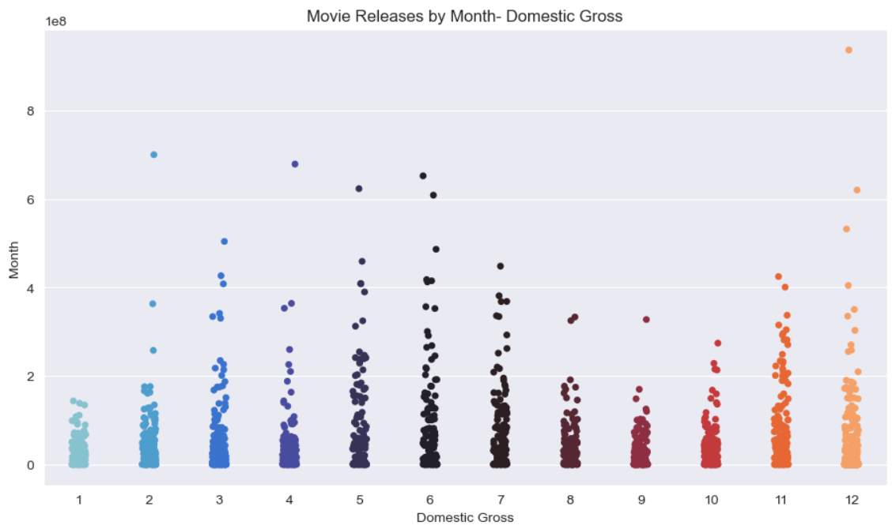

# Welcome to the film industry exploration!


***
# Navigation
* [Project Overview](#Project-Overview)
* [Business Problem](#Business-Problem)
* [Business Problem/Understanding](#Business-Problem/Understanding)
* [Data Understanding](#Data-Understanding)
* [Methods/Data Analysis](#Methods/Data-Analysis)
* [Recommendation 1](#Recommendation-1)
* [Recommendation 2](#Recommendation-2)
* [Recommendation 3](#Recommendation-3)
* [Conclusion](#Conclusion)
* [Future Work](#Future-Work)
* [Repository Structure](#Repository-Structure)
***
# Important Links

* [Slideshow Presentation](https://github.com/KImondorose/dsc-phase-1-project/blob/main/movie_analysis_slides.pdf)
* [Jupyter Notebook with Cleaning & Questions](https://github.com/KImondorose/dsc-phase-1-project/blob/main/index.ipynb)
***
# Project Overview

The task at hand is to assist Microsoft in their new venture of creating a movie studio and identify the types of films that are doing well at the Box Office.<br>

My analysis of the movie industry which was done by gathering data from IMDB, The Numbers, and The Box Office Mojo and producing descriptive statistics and visualizations finds that:<br>

* **Genre:** The highest grossing films made by the leading studios are animated, superhero, scifi, and fantasy movies, which should be the genres that the new studio should focus on.<br>
* **Production Budget:** There is a very strong relationship between the production budget and ROI. If the studio has a lot of money to invest, they should choose a sci-fi/fantasy/superhero franchise film. However, with a small budget, they can choose a horror film and still get a high ROI.<br>
* **Release Month:** Based on the analysis, the four months with the highest earnings based on domestic and worldwide returns are July, November, August, and February. Microsoft should focus on releasing movies during these months.<br>

Microsoft can use this report to target their production budget, genre, and release time to generate the highest amount of revenue possible.<br>
***
***
# Business Problem/Understanding

> Microsoft sees the allure of the film business and feels that they also need to get into the market. The decision involves the creation of a new movie studio. However, there is a limitation surrounding information with little awareness of what to do, how to enter the market, what movies to make, when to make them, which studios to emulate, how much money to invest, and a lot of other crucial matters that need understanding before any other steps can be taken.<br>

>> The task at hand is to explore the types of films that are doing well at tbhe Box Office and translate these findings into useful insights to help Microsoft decide on the way forward.<br>

The topics informing the questions for this analysis are:
* Genre
* Release month
* Production budget

***
Data Questions:
1. a. Which studios make the highest grossing films?<br>
   b. What are the genres of the highest grossing films that are made by these studios?<br>
     
2. a.  How does spending on production translate to Gross Earnings? Does higher spending lead to higher earnings?<br>    
     b. What is the relationship between the production budget and the gross earnings?<br>
     c. Which genre has the highest return on Investment?<br>

3. When should the films be released? Which release months make the most money?<br>

4. Which movie genres receive the highest ratings?
***
***
# Data Understanding
I used three different data sources for my analysis to have a comprehensive view of the industry:<br>

* The Numbers Movie Budget- The most important information from this dataset were the release dates, production budget, domestic gross, and worldwide gross earnings. These were used to determine the relationship between the production budget and the earnings, and the release month and the earnings.<br>

* The Box Office Mojo movie gross earnings: This data was used to determine the studios that have the highest grossing movies and then identify the genres that the top grossing movies from the studios belong to.<br>

* IMDB- The data was used to analyze the ratings for different genres and affirm our conclusions from the Box Office Mojo data.<br>

# Methods/Data Analysis
After opening the raw datasets with pandas, we cleaned and prepared the data by converting some string data types to float, removing the rows of null values that prevented us from doing transformations, separating rows where a column has many values together, and merging datasets through key columns. Data was further cleaned by obtaining relevant subsets for the analysis performed.

Descriptive analysis was used through the use of bar graphs, scatter plots, and aggregate functions. Since the business problem is to identify the type of movie to make based on past data, we opted to identify trends using graphs.<br>
***
# Recommendation 1:

#### **The movie genre should be animated, superhero, scifi, or fantasy**


To conclude, we looked at the bom_movie_gross dataset from Box Office Mojo. The top-grossing films were defined as those with the highest gross earnings.<br>

We also affirmed our findings using the IMDB data (`movie_basics` and `movie_ratings` tables)

The top five studios with the top grossing films are:<br>
* Buena Vista (BV) | total domestic gross: $18.4 billion

* Universal Studios (Uni.) | total domestic gross: $12.9 billion

* Warner Bros. (WB) | total domestic gross: $12.1 billion

* 20th Century Fox (Fox) | total domestic gross: $1.1 billion

* Sony | total domestic gross: $8.4 billion

We then further investigated the top grossing studios by looking at the top 10 films for each of the studios.<br>

We can easily see a pattern in the qualities and genres of these films. Most of them are action films.<br>

They are superhero films (e.g. Avengers, Deadpool, The Dark Knight, etc), sci-fi/fantasy franchises (e.g. Star Wars, Jurassic World, Harry Potter, Dawn of the Planet of the Apes, etc), and animated films for kids & families (e.g. Incredibles, Despicable Me, etc).<br>

From the IMDB data analysis, these genres also had high ratings based on the median value, and this affirms the recommendation that they are great genres to focus on.<br>

Please note that since I could not upload the IMBD file to github since it is too large, it is in the gitignore folder.


**RECOMMENDATIONS**

Based on these findings, the recommendation is to make films that have these qualities (animated, superhero, scifi, fantasy).<br>

Investing in the scifi/fantasy and superhero franchises seems to be a good idea as we can see a positive trend for these films from 2010 - 2018.<br>

It can also be concluded that benchmarking these five studios (Buena Vista, Universal, Warner Bros, Fox, and Sony) will be an excellent idea for identifying their best practices to emulate them<br>
***

<br /> <br />
<br /> <br />
<br /> <br />
<br /> <br />
<br /> <br />
<br /> <br /> <br />
***
***
# Recommendation 2: 

#### **With a large production budget, the sci-fi/fantasy/superhero franchises will make the most money**
#### **With a small production budget, the horror movie genre is still guaranteed to give a huge ROI**

To get to a conclusion, we looked at the tn_movie_budgets dataset and narrowed our analysis to films releases from 2010 to 2019, in line with the analysis done in question one. The key question was whether there was a relationship between the movie's production budget and its gross earnings.<br>

Using Seaborn replots it was easy to see the relationship<br>

>In the `Production Budget and Domestic Gross Plot`, as the production budget increases, so does the domestic gross. Most of the movies with budgets of less than 100 million dollars do not make more tham 500 million dollars. Movies that made more tham 600 million dollars had production budgets of over 200 million. Also, the correlation coeeficient between the production budget and domestic gross is very strong strong (0.73).<br>
>
>In the `Production Budget and Worldwide Gross` plot we can see a similar trend. The correlation coefficient between the two variables was very strong (0.8).<br>

>>The conclusion is that there is a very strong relationship between production budget and gross earnings.<br>

We further investigated the ROI. By calculating the ROI using worldwide gross, we saw that many movies had negative returns. However, there were many movies that made 50x or even 400x their production budget. Looking at the top 20 movies with the highest ROIs, we can see that most of these are horror films.<br>

**RECOMMENDATIONS**

Based on these findings, this is the question to ask ourselves:
* How big is our production budget?
We can merge our answer with that of question one.<br>

The conclusion is that is we have a lot of money to invest, we can choose a sci-fi/fantasy/superhero franchise film, use a large production budget, and make more gross earnings.<br>

With a small budget, we can choose a horror film and get a large ROI.<br> 

***
<br /> <br />
<br /> <br />
<br /><br/> <br/>
***
***
# Recommendation 3

#### **Films should be released in July, November, August, and February**

To answer this question, the tn_movie_budgets database provided movie release dates and gross worldwide and domestic earnings. Looking at the domestic gross by month over 10 years (2010 - 2019), we can find the months with the highest domestic gross. Using these ten years gives data with ten occurences for each month.<br>

The median was used as an indicator to rule out outliers.<br>

The five highest grossing months based on domestic returns are:<br>

* July - $31,206,263

* November - $30,659,817

* August - $21,295,021

* April - $20,316,694

* February - $19,452,138

The five highest grossing months based on worldwide returns are:<br>

* November - $60,217,171

* July - $57,273,049

* February- $43,528,634

* January - $43,061,376

* August - $40,650,842

**RECOMMENDATIONS**

Based on these findings, the common months are July, November, August, and February. This is also evidenced from the bar and strip plots where the figures for these months are larger than the rest.<br>

***
<br /> <br />
<br /> <br />
<br /> <br />
<br /> <br /><br />

***
***
# Conclusion
In conclusion, I discovered that the best films to create should reflect the following recommendations:<br>

- If we want to start with a small budget, we should focus on horror films, which produce the highest returns.

- If we want to jump into the industry with a large budget, we should either:
    * Create movies in a sci-fi/fantasy/superhero franchise.
    * Create animated films, which will also likely garner positive reviews. 
    
- The ratings should not be a major influencer of our decisions because each genre seems to receive a similar range of ratings. 

- We should plan on releasing our films in July, November, August, and February, to capture the highest gross earnings. 
***
***
# Future Work

If I had time to explore further, I would investigate the following:
    
  - Calculate a more accurate ROI model based on all costs (i.e. marketing budget, distribution costs, etc)
***
***
# Repository Structure
```
├── README.md                        <- The top-level README for reviewers of this project
├── index.ipynb                      <- Narrative documentation of analysis in Jupyter notebook
├── movie_analysis_slides.pdf        <- PDF version of project presentation
├── movie_notebook.pdf               <- PDF version of Jupyter notebook
├── data                             <- Sourced from The Box Office Mojo, The Numbers, and IMDB
├── .gitignore                       <- Large IMDB database file ignored 
├── images                           <- Images used in the code
└── analysis_images                  <- Images sourced from the code
```
***
For any additional questions, please contact **Rose Kimondo** at rosewairimu1@gmail.com.
***